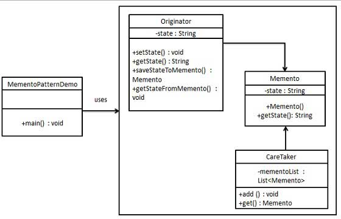

# Memento Design Pattern 
Behavioral design pattern 

- Parts 
    -- Memento: Stores internal state of the Originator object 
    -- Originator:  Creates memento objecct 
    -- Caretaker: Responsible to keeping the memento 

- Usage
    -- A snapshop of an object, the state must be stored in order to restore the previous state 
