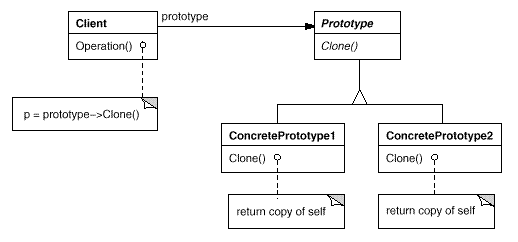

# Prototype Design pattern 

- creational design pattern 

Prototype deign pattern creates object based on an existing object through cloning 

- when to use the prototype design patter?:
    -- when the classes to instantiate and specified at run-time (dynamic loading)
    -- when instances of aclass can have one of only a fiew different cominations of state 

- Advantage:
    -- reduces the need of sub-classing 
    -- it hides complexities of creating objects 

