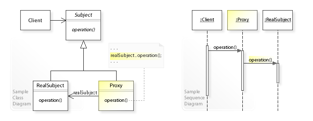

# Proxy design pattern 

### The Reason 
#### Structural design pattern
The client does not directly talk to the original object,  The proxy controls acceess to another object

### Actors 
#### Subject 
The Interface for the original subject and the proxy 
#### Proxy 
The proxy: Proxy has access to the Real subject 
#### RealSubject 
Rel object tat the proxy represents 